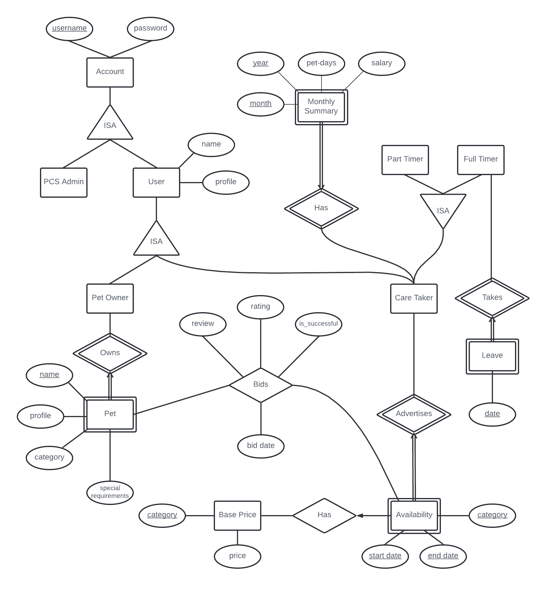

# Preliminary Constraints

Note: png and pdf of ER diagram is in the same folder

## General Account Information

1. An account is a PCS Admin or a User 
    - Covering constraint on ISA hierarchy
2. An account must consist of username and password
3. A User is either a Pet Owner, or Care Taker, or both
    - Covering + Overlap constraint on ISA hierarchy
4. A User must consist of a name and profile

## Pet

1. A Pet must consist of a name, a profile and a category
2. A Pet may have special requirements
2. A Pet must be owned by a Pet Owner
    - Identity dependency
    - Name as partial key
      - It is probably realistic to assume that a pet owner will not use the same name for two different pets
3. A Pet Owner can own multiple Pets

## Care Taker Availability

1. An Availability must consist of a start date, an end date, the category of the pet that the Care Taker can care for, and the daily price
2. Care Takers can create and advertise their Availability 
    - Identity dependency
    - Start date, end date and category as partial keys
3. Availabilities with the same category should not have overlapping start/end dates 
    - Cannot be reflected on ER diagram

## Bid

1. A Pet Owner can bid for a Care Taker's Availability for their Pet
2. A Bid consists of a date (single day) that falls within that of the Care Taker's Availability
    - i.e. Pet owner cannot choose a date the Care Taker is unavailable for
3. A Bid is only valid if the category of the Pet matches the category of the Availability
    - Cannot be reflected on ER diagram
4. A Care Taker can choose to accept or reject a Bid. The Bid accepted by the Care Taker will be known as a successful Bid

## Review and Rating

1. A Pet Owner can post a review on a Care Taker based on a successful bid
2. A Pet Owner can give a rating on a Care Taker based on a successful bid

## Care Taker Working Status

1. A Care Taker is either a Full Timer, or Part Timer
    - Covering constraint on ISA hierarchy
2. A Full Timer can choose to specify the date they wish to take Leave
    - Identity dependency
    - Date as partial key
3. A Full Timer cannot create an Availability on days covered by their Leave

## Care Taker Pet Limit

1. A Care Taker cannot take care of more than 5 Pets on any single day
    - For any bid, the database can check if there are 5 or more successful Bids active on that day
        - If there are 5 or more successful Bids, the Care Taker will not be able to accept the bid. Else, the Care Taker can accept the bid
    - Cannot be reflected on ER diagram

## Care Taker Monthly Summary

1. A Monthly Summary consists of year, month, pet-days and salary
2. Every Care Taker has a Monthly Summary for each Month they have worked
    - Identity dependency
    - Year and Month as partial key
3. Each successful bid adds one pet day to the monthly summary on the month that the bid takes place in
4. Each successful bid adds the price of the category of the pet to the monthly summary on the month that the bid takes place in

## Base Price

1. The Base Price of different categories of Pets should be recorded in a list, and can be modified by PCS Admin at any time
    - No way to show only PCS Admin can modify the table

