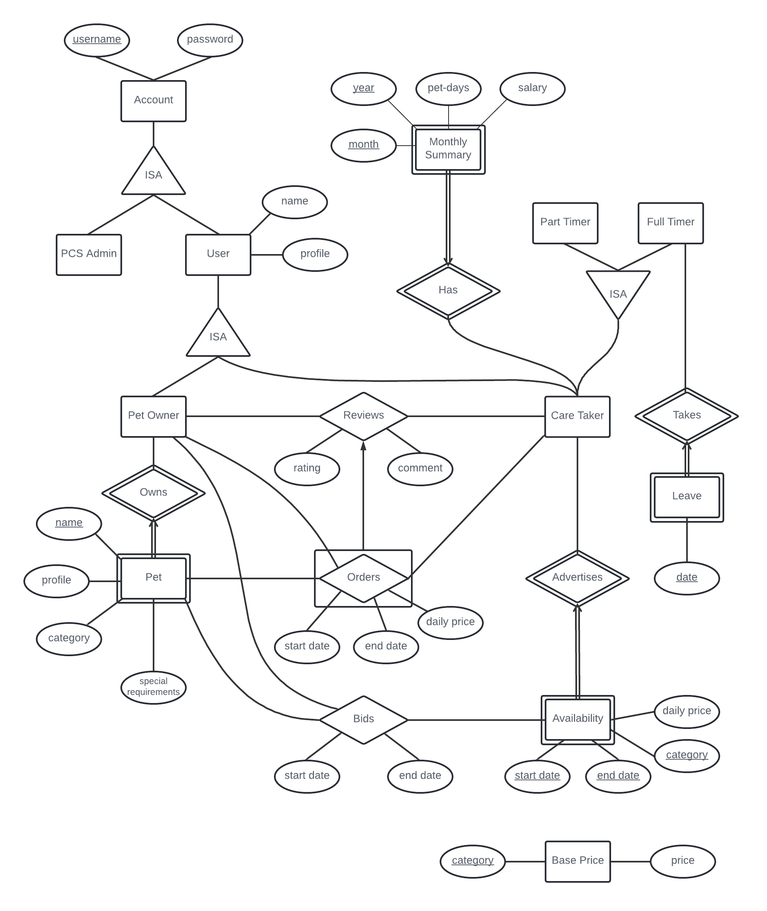

# Preliminary Constraints

Note: png and pdf of ER diagram is in the same folder

## General Account Information

1. An account is a PCS Admin or a User 
    - Covering constraint on ISA hierarchy
2. An account must consist of username and password
3. A User is either a Pet Owner, or Care Taker, or both
    - Covering + Overlap constraint on ISA hierarchy
4. A User must contain a profile

## Pet

1. A Pet must contain a profile
2. A Pet must be owned by a Pet Owner
    - Identity dependency
    - Name as partial key
3. A Pet Owner can own multiple Pets

## Care Taker Availability

1. An Availability contains a start date, an end date, the category of the pet that the Care Taker  can care for, and the daily price
2. Care Takers can create and advertise their Availability 
    - Identity dependency
    - Start date, end date and category as partial keys
3. Availabilities with the same category should not have overlapping start/end dates 
    - Cannot be reflected on ER diagram

## Bid

1. A Pet Owner can bid for a Care Taker's Availability for their Pet
2. A Bid consists of a start date and end date that falls within that of the Care Taker's Availability
    - i.e. Pet owner cannot choose a date the Care Taker is unavailable for
3. A Bid is only valid if the category of the Pet matches the category of the Availability
    - Cannot be reflected on ER diagram
4. A Care Taker can only accept a single Bid per Availability. The Bid accepted by the Care Taker is also known as a successful Bid
    - Cannot be reflected on ER diagram
5. Successful Bid are converted into Orders
    - Cannot be reflected on ER diagram
6. Unsuccessful Bids are discarded
    - Cannot be reflected on ER diagram
7. The Availability is removed once a bid is successful. New Availabilities for days excluded by the successful Bid are created
    - For instance:
      - An Availability has start date Monday and end date Friday
      - The successful Bid has start date Tuesday and end date Thursday
      - A new Availability with start and end dates Monday is created
      - A new Availability with start and end dates Friday is created
    - Cannot be reflected on ER diagram
    
## Order

1. An Order takes place between a Pet Owner and a Care Taker for a Pet after a successful Bid 
2. An Order consists of the start date and end date as specified by the successful Bid, as well as the daily price as stated in the Care Taker's Availability

## Review

1. A Pet Owner can post a review on a Care Taker based on an Order
2. A review consists of a rating from 0 to 5 stars, and a comment

## Care Taker Working Status

1. A Care Taker is either a Full Timer, or Part Timer
    - Covering constraint on ISA hierarchy
2. A Full Timer can choose to specify the date they wish to take Leave
    - Identity dependency
    - Date as partial key
3. A Full Timer cannot create an Availability on days covered by their Leave

## Care Taker Monthly Summary

1. A Monthly Summary consists of year, month, pet-days and salary
2. At the start of each Month, a Monthly Summary of the previous Month is created
    - Cannot be reflected on ER diagram
3. Every Care Taker has a Monthly Summary for each Month they worked
    - Identity dependency
    - Year and Month as partial key
4. Pet-days are calculated by checking each Order that has a start or end date belonging to that month, and then adding the pet-days in that month
    - Case 1: start date and end date within month
      - Add number of days from start to end
    - Case 2: start date within month, end date not within month
      - Add number of days from start date of Order to last date of month
    - Case 3: start date not within month, end date within month
      - Add number of days from start date of month to end date of Order
5. Salary is calculated by checking each Order that has a start or end date belonging to that month, and then adding the daily price multiplied by the pet-days in that month. The salary is also affected by whether the Care Taker is a Full Timer of Part Timer
    - Case Full Timer: Care Taker takes 85% of price
      - It does not make sense that a Full Timer takes a fixed rate for the first 60 pet-days. An alternative is to provide a better incentive than Part Timers
    - Case Part Timer: Care Taker takes 75% of price
    - Example, an Order from 30th of October to 2nd of November at a daily price of $50 will contribute $50 * 2 * 0.85 = $85 to the salary of a Full Timer for October 

## Base Price

1. The Base Price of different categories of Pets should be recorded in a list, and can be modified by PCS Admin at any time
    - No way to show only PCS Admin can modify the table
2. The daily price of an Availability is determined by a variety of factors, such as the Base Price of the category and the average rating of the Care Taker
    - E.g. (Base Price of Category) + (Rating * 4)
    - Base Price to be obtained from the base price list
